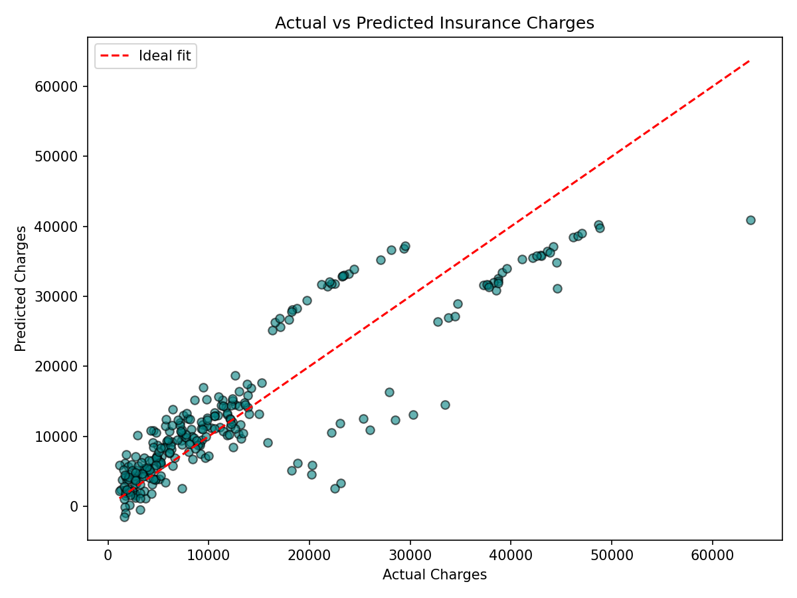

# Medical Insurance Cost Prediction using Multiple Linear Regression

## Objective
To build a Multiple Linear Regression model that predicts a customer's
medical insurance charges based on personal and health-related information
(age, sex, BMI, number of children, smoking status, and region).

## Dataset Link
[Medical Cost Personal Insurance Dataset — Kaggle](https://www.kaggle.com/datasets/mirichoi0218/insurance)

The dataset (`insurance.csv`) is included in this repository for
convenience, and is also available at the Kaggle link above.

## Libraries Used
- pandas
- numpy
- scikit-learn
- matplotlib

## Methodology
1. **Data Understanding**: Loaded the dataset, inspected the first five
   records, and identified numerical features (age, bmi, children),
   categorical features (sex, smoker, region), and the target variable
   (charges).
2. **Data Preprocessing**:
   - Checked for missing values (none found).
   - Encoded categorical variables: `sex` and `smoker` were binary-encoded,
     and `region` was one-hot encoded (drop-first to avoid multicollinearity).
   - Split the data into 80% training and 20% testing sets.
3. **Model Development**: Trained a `LinearRegression` model from
   scikit-learn using age, sex, bmi, children, smoker, and region as
   features to predict charges.
4. **Model Evaluation**: Evaluated the model on the test set using MAE,
   MSE, and R² score, and plotted actual vs predicted charges.

## Results
| Metric | Value |
|--------|-------|
| MAE    | ≈ 4181.19 |
| MSE    | ≈ 33,596,915.85 |
| R² Score | ≈ 0.78 |

Smoking status was the strongest predictor of insurance charges by a wide
margin, followed by BMI and age. Region and sex had comparatively minor
effects on the predicted charges.



## Conclusion
This project built a Multiple Linear Regression model to predict medical
insurance charges using age, sex, BMI, number of children, smoking status,
and region. The model achieved an R² score of approximately 0.78,
indicating a reasonably good fit to the test data. Smoking status emerged
as the single strongest predictor of charges, followed by age and BMI,
while sex and region had comparatively minor effects. These findings align
with real-world expectations, since smokers and older, higher-BMI
individuals generally carry greater health risk and therefore higher
insurance costs. A key limitation of Linear Regression here is its
assumption of a linear relationship between features and charges; in
reality, costs rise sharply and non-linearly for high-risk groups such as
smokers, which the model cannot fully capture. A non-linear approach
(e.g. polynomial regression or tree-based models) may fit this data
better.

## How to Run
```bash
pip install pandas numpy scikit-learn matplotlib
python Assignment-1.py
```
or open `Assignment-1.ipynb` in Jupyter and run all cells.